# 🏗️ Habit Breaker - Extended Architecture
## Multi-Platform System with Financial Incentives

**Version:** 2.0 (Desktop + Mobile + Chrome Extension)  
**Date:** December 2025

---

## 📋 Overview

Habit Breaker now extends beyond Chrome Extension to support:
- 🖥️ **Desktop Application** (Electron) - Monitor all desktop apps
- 📱 **Mobile Application** (React Native/Flutter) - Monitor mobile apps
- 🌐 **Chrome Extension** (Existing) - Monitor browser activity
- 💰 **Financial Incentive System** (Stripe) - Money commitment & rewards
- 🍔 **UberEats Integration** - Reward system for good behavior
- 🎬 **Virtual Tour** (Anam) - Interactive app walkthrough

---

## 🎯 New Features

### 1. 💰 Financial Commitment System
- **Initial Deposit:** Users commit money when starting the app
- **Penalty Mechanism:** Money is deducted when using distracting apps
- **Reward System:** If no distractions, user gets UberEats order
- **Stripe Integration:** Secure payment processing

### 2. 🖥️ Desktop App Monitoring
- **Application Detection:** Monitor all desktop applications (not just browser)
- **Active Window Tracking:** Detect which app is currently active
- **Time Tracking:** Track time spent in each application
- **Platform Support:** Windows, macOS, Linux

### 3. 📱 Mobile App Monitoring
- **App Usage Tracking:** Monitor all installed apps
- **Screen Time API:** Use native iOS/Android APIs
- **Background Monitoring:** Track usage even when app is closed
- **Cross-Platform:** iOS and Android support

### 4. 🍔 UberEats Reward System
- **API Integration:** Connect to UberEats API
- **Automatic Ordering:** Order food when user achieves goals
- **Budget Management:** Use committed money for rewards
- **Delivery Tracking:** Show order status

### 5. 🎬 Virtual Tour System
- **Interactive Walkthrough:** Guide new users through features
- **3D/AR Elements:** Enhanced visual experience
- **Multi-language Support:** English, Chinese, etc.
- **Anam Integration:** Specialized tour creation

---

## 🏗️ System Architecture

### High-Level Architecture

```mermaid
graph TB
    subgraph "👤 User Devices"
        CE[Chrome Extension<br/>Browser Monitoring]
        DA[Desktop App<br/>Electron + active-win]
        MA[Mobile App<br/>React Native/Flutter]
    end
    
    subgraph "🔌 Client Layer"
        CE --> API1[Extension API<br/>Chrome APIs]
        DA --> API2[Desktop API<br/>active-win + Electron IPC]
        MA --> API3[Mobile API<br/>Screen Time + Usage Stats]
    end
    
    subgraph "⚙️ Backend Server (Node.js + Express)"
        API1 --> Backend[Backend API<br/>Port 3000]
        API2 --> Backend
        API3 --> Backend
        
        Backend --> LLM[🧠 Groq LLM<br/>Message Generation]
        Backend --> TTS[🎙️ ElevenLabs<br/>Voice Synthesis]
        Backend --> DB[(💾 Database<br/>PostgreSQL/MongoDB)]
        Backend --> Stripe[💳 Stripe API<br/>Payment Processing]
        Backend --> Uber[🍔 UberEats API<br/>Reward Orders]
    end
    
    subgraph "📊 Services & Integrations"
        Stripe --> Payment[Payment Gateway]
        Uber --> Delivery[Food Delivery]
        DB --> Report[📧 Email Reports<br/>n8n + Gmail]
        DB --> Tour[🎬 Virtual Tour<br/>Anam Platform]
    end
    
    subgraph "💾 Data Storage"
        DB --> UserData[(User Profiles<br/>Settings & History)]
        DB --> Financial[(Financial Records<br/>Deposits & Penalties)]
        DB --> AppTracking[(App Usage Data<br/>Time & Patterns)]
    end
    
    style CE fill:#667eea,color:#fff
    style DA fill:#8b5cf6,color:#fff
    style MA fill:#10b981,color:#fff
    style Backend fill:#764ba2,color:#fff
    style Stripe fill:#635bff,color:#fff
    style Uber fill:#000,color:#fff
    style DB fill:#fbbf24,color:#000
```



---

## 🔄 Data Flow Sequence

### Financial Commitment & Penalty Flow

```mermaid
sequenceDiagram
    participant User
    participant Client as Desktop/Mobile/Extension
    participant Backend as Backend API
    participant Stripe as Stripe API
    participant DB as Database
    participant Uber as UberEats API
    
    User->>Client: Open App (First Time)
    Client->>Backend: POST /api/user/register
    Backend->>Stripe: Create Payment Intent
    Stripe-->>Backend: Payment Intent ID
    Backend-->>Client: Show Payment Form
    User->>Stripe: Enter Payment Details
    Stripe-->>Backend: Payment Confirmed
    Backend->>DB: Store Deposit Amount
    Backend-->>Client: Account Activated
    
    Note over Client,DB: User Starts Using Apps
    
    Client->>Client: Monitor App Usage
    Client->>Backend: POST /api/tracking/app-usage<br/>{appName, timeSpent, isDistracting}
    
    alt Distracting App Detected
        Backend->>DB: Check Penalty Rules
        Backend->>Stripe: Charge Penalty Fee
        Stripe-->>Backend: Payment Processed
        Backend->>DB: Deduct from Balance
        Backend->>LLM: Generate Intervention Message
        Backend-->>Client: Show Warning + Penalty Notice
    end
    
    Note over Client,DB: End of Day - Check Rewards
    
    Backend->>DB: Calculate Daily Stats
    alt No Distractions Today
        Backend->>Uber: Create Order Request
        Uber-->>Backend: Order Confirmed
        Backend->>Stripe: Refund/Use Balance
        Backend-->>Client: 🎉 Reward Notification
    end
```



---

## 🖥️ Desktop Application Architecture

### Electron + active-win Implementation


**Key Technologies:**
- **Electron:** Cross-platform desktop framework
- **active-win:** Node.js module for detecting active window/app
- **electron-store:** Local data persistence
- **React/Next.js:** UI framework for desktop app

---

## 📱 Mobile Application Architecture

### React Native / Flutter Implementation


**Key Technologies:**
- **React Native / Flutter:** Cross-platform mobile framework
- **iOS Screen Time API:** Native iOS app usage tracking
- **Android UsageStatsManager:** Native Android app monitoring
- **Background Tasks:** Keep monitoring active in background

---

## 💳 Stripe Integration Architecture

### Payment Flow


**Stripe Endpoints:**
- `POST /api/stripe/create-payment-intent` - Initial deposit
- `POST /api/stripe/charge-penalty` - Deduct money for distraction
- `POST /api/stripe/process-reward` - Process UberEats order
- `POST /api/stripe/webhook` - Handle Stripe webhooks

---

## 🍔 UberEats Integration

### Order Flow


**UberEats API Endpoints:**
- `POST /api/uber/check-availability` - Check delivery availability
- `POST /api/uber/create-order` - Create food order
- `GET /api/uber/order-status/:id` - Track order status
- `POST /api/uber/cancel-order` - Cancel order (if needed)

---

## 🎬 Virtual Tour System (Anam)

### Tour Architecture


**Anam Integration:**
- Interactive walkthrough for new users
- Highlight key features (deposit, monitoring, rewards)
- Multi-language support
- 3D/AR elements for enhanced experience

---

## 📊 Database Schema

### Core Tables

```sql
-- Users Table
CREATE TABLE users (
    id UUID PRIMARY KEY,
    email VARCHAR(255) UNIQUE,
    stripe_customer_id VARCHAR(255),
    current_balance DECIMAL(10,2),
    created_at TIMESTAMP,
    updated_at TIMESTAMP
);

-- Financial Transactions
CREATE TABLE transactions (
    id UUID PRIMARY KEY,
    user_id UUID REFERENCES users(id),
    type VARCHAR(50), -- 'deposit', 'penalty', 'reward', 'refund'
    amount DECIMAL(10,2),
    stripe_payment_id VARCHAR(255),
    status VARCHAR(50),
    created_at TIMESTAMP
);

-- App Usage Tracking
CREATE TABLE app_usage (
    id UUID PRIMARY KEY,
    user_id UUID REFERENCES users(id),
    platform VARCHAR(50), -- 'desktop', 'mobile', 'browser'
    app_name VARCHAR(255),
    is_distracting BOOLEAN,
    time_spent INTEGER, -- seconds
    date DATE,
    created_at TIMESTAMP
);

-- Daily Goals
CREATE TABLE daily_goals (
    id UUID PRIMARY KEY,
    user_id UUID REFERENCES users(id),
    date DATE,
    goal_met BOOLEAN,
    total_distracting_time INTEGER,
    reward_claimed BOOLEAN,
    uber_order_id VARCHAR(255),
    created_at TIMESTAMP
);
```

---

## 🔌 API Endpoints (Extended)

### New Endpoints

```
# User & Financial Management
POST   /api/user/register              # Register new user
POST   /api/user/deposit               # Create Stripe payment intent
GET    /api/user/balance               # Get current balance
GET    /api/user/transactions          # Get transaction history

# App Tracking (Multi-platform)
POST   /api/tracking/app-usage         # Report app usage (Desktop/Mobile)
POST   /api/tracking/browser-usage     # Report browser usage (Extension)
GET    /api/tracking/daily-stats       # Get daily statistics

# Stripe Integration
POST   /api/stripe/create-payment-intent  # Create deposit payment
POST   /api/stripe/charge-penalty         # Charge penalty fee
POST   /api/stripe/process-reward         # Process reward payment
POST   /api/stripe/webhook                # Stripe webhook handler

# UberEats Integration
POST   /api/uber/check-availability    # Check delivery availability
POST   /api/uber/create-order          # Create food order
GET    /api/uber/order-status/:id      # Get order status
POST   /api/uber/cancel-order          # Cancel order

# Virtual Tour
GET    /api/tour/get-tour              # Get tour data (Anam)
POST   /api/tour/complete-step         # Mark tour step as complete
GET    /api/tour/progress               # Get tour progress

# Existing Endpoints (Chrome Extension)
POST   /api/generate-intervention      # Generate intervention message
POST   /api/should-intervene           # LLM-based intervention decision
POST   /api/daily-report               # Generate daily report
POST   /api/send-email-report          # Send email report
```

---

## 🛠️ Technology Stack (Extended)

### Frontend
- **Chrome Extension:** JavaScript ES6+, Manifest V3
- **Desktop App:** Electron + React/Next.js
- **Mobile App:** React Native / Flutter
- **UI Framework:** React, Tailwind CSS

### Backend
- **Server:** Node.js + Express
- **Database:** PostgreSQL / MongoDB
- **ORM:** Prisma / Mongoose
- **Real-time:** WebSocket (Socket.io)

### Integrations
- **Payment:** Stripe API
- **Food Delivery:** UberEats API
- **LLM:** Groq (Llama 3.3 70B)
- **TTS:** ElevenLabs
- **Email:** nodemailer + Gmail SMTP
- **Automation:** n8n
- **Tour:** Anam Platform

### Native Modules
- **Desktop:** `active-win` (Node.js)
- **iOS:** Screen Time API (Swift)
- **Android:** UsageStatsManager (Kotlin/Java)

---

## 📁 Project Structure (Extended)

```
Habit_Breaker/
├── extension/              # Chrome Extension (Existing)
│   ├── background.js
│   ├── content.js
│   └── popup.html
│
├── desktop/                # Desktop Application (NEW)
│   ├── electron/
│   │   ├── main.js         # Electron main process
│   │   ├── preload.js
│   │   └── app-monitor.js  # active-win integration
│   ├── renderer/           # React UI
│   │   ├── src/
│   │   │   ├── components/
│   │   │   ├── pages/
│   │   │   └── App.jsx
│   │   └── package.json
│   └── package.json
│
├── mobile/                 # Mobile Application (NEW)
│   ├── ios/                # iOS native code
│   │   ├── AppMonitor.swift
│   │   └── Info.plist
│   ├── android/            # Android native code
│   │   ├── AppMonitor.kt
│   │   └── AndroidManifest.xml
│   ├── src/                # React Native/Flutter code
│   │   ├── screens/
│   │   ├── components/
│   │   └── App.js
│   └── package.json
│
├── backend/                 # Backend Server (Extended)
│   ├── server.js
│   ├── routes/
│   │   ├── user.js         # User management
│   │   ├── tracking.js     # App usage tracking
│   │   ├── stripe.js        # Stripe integration
│   │   ├── uber.js          # UberEats integration
│   │   └── tour.js          # Virtual tour
│   ├── services/
│   │   ├── stripe-service.js
│   │   ├── uber-service.js
│   │   └── app-monitor-service.js
│   ├── models/              # Database models
│   │   ├── User.js
│   │   ├── Transaction.js
│   │   └── AppUsage.js
│   └── package.json
│
├── shared/                  # Shared Code (NEW)
│   ├── constants/
│   │   └── distracting-apps.js
│   ├── utils/
│   │   └── time-formatter.js
│   └── types/               # TypeScript types (optional)
│
└── tour/                    # Virtual Tour Assets (NEW)
    ├── anam-config.json
    ├── assets/
    │   ├── 3d-models/
    │   └── audio/
    └── steps/
        └── tour-steps.json
```

---

## 🚀 Deployment Architecture

### Production Setup


---

## 🔐 Security Considerations

1. **Payment Security:**
   - Stripe handles all payment data (PCI compliant)
   - Never store credit card information
   - Use Stripe webhooks for payment verification

2. **App Monitoring Permissions:**
   - Desktop: Request accessibility permissions
   - Mobile: Request Screen Time / Usage Stats permissions
   - Clear privacy policy for data collection

3. **API Security:**
   - JWT authentication for all API calls
   - Rate limiting on sensitive endpoints
   - Input validation and sanitization

4. **Data Privacy:**
   - Encrypt sensitive user data
   - GDPR compliance for EU users
   - User data deletion on request

---

## 📈 Scalability Considerations

1. **Database:**
   - Use connection pooling
   - Index frequently queried fields
   - Consider read replicas for analytics

2. **API:**
   - Load balancing with multiple instances
   - Caching with Redis
   - Queue system for background jobs

3. **Real-time Updates:**
   - WebSocket connections for live tracking
   - Server-Sent Events (SSE) for notifications

---

## 🎯 Success Metrics

1. **User Engagement:**
   - Daily active users (DAU)
   - Average session duration
   - Intervention success rate

2. **Financial Metrics:**
   - Total deposits
   - Penalty collection rate
   - Reward redemption rate

3. **Productivity Impact:**
   - Average distraction time reduction
   - Goal achievement rate
   - User retention rate

---

## 📝 Next Steps

1. **Phase 1: Desktop App (Week 1-2)**
   - Set up Electron project
   - Integrate active-win
   - Basic UI and monitoring

2. **Phase 2: Stripe Integration (Week 2-3)**
   - Payment flow implementation
   - Penalty system
   - Balance management

3. **Phase 3: Mobile App (Week 3-4)**
   - React Native/Flutter setup
   - Native module integration
   - Cross-platform testing

4. **Phase 4: UberEats Integration (Week 4-5)**
   - API integration
   - Order flow
   - Delivery tracking

5. **Phase 5: Virtual Tour (Week 5-6)**
   - Anam integration
   - Tour creation
   - Multi-platform support

---

**Last Updated:** December 2025  
**Version:** 2.0.0

